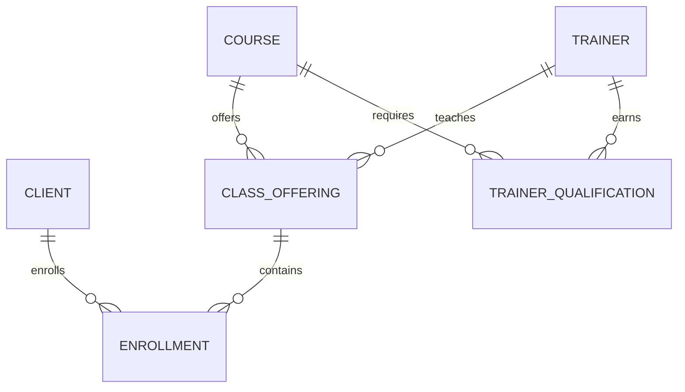

```mermaid
erDiagram
  CLIENT ||--o{ ENROLLMENT : enrolls
  CLASS_OFFERING ||--o{ ENROLLMENT : contains
  COURSE ||--o{ CLASS_OFFERING : offers
  TRAINER ||--o{ CLASS_OFFERING : teaches
  TRAINER ||--o{ TRAINER_QUALIFICATION : earns
  COURSE ||--o{ TRAINER_QUALIFICATION : requires
```
